# Exercice 1 : Introduction à Beepbox

Dans ce premier exercice, vous allez explorer l'outil [Beepbox](https://www.beepbox.co/) et analyser un fichier musical. Suivez les étapes ci-dessous pour importer le fichier et réaliser votre analyse.

## Étape 1 : Importer le fichier
1. Téléchargez le fichier **exercice1.json**.
2. Allez sur [beepbox.co](https://www.beepbox.co/).
3. Cliquez sur le menu **File** puis sélectionnez **Import Song**.
4. Repérez le fichier **exercice1.json** dans votre dossier de téléchargement et importez-le.

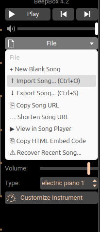

---

## Analyse musicale

### 1. Harmonie

#### a. Les accords
Un accord est un groupe de notes jouées ensemble, créant une base harmonique agréable. Les musiciens utilisent les accords pour donner de la structure et de la cohérence à une chanson. Répéter les mêmes accords contribue à cette constance, ce qui plaît souvent aux auditeurs.

> La majorité des chansons populaires utilisent [les mêmes 4 accords en boucle.](https://www.youtube.com/watch?v=Ws-hLzafkng)

Dans cet exercice, la chanson est en **La mineur** et les accords utilisés sont :
- **La mineur** - **Fa majeur** - **Ré mineur** - **Mi majeur** ( i - VI - iv - V )

Pour visualiser les accords dans Beepbox :
1. Cliquez sur l'instrument **orange** dans le menu du bas, c'est l'instrument d'harmonie.
   
   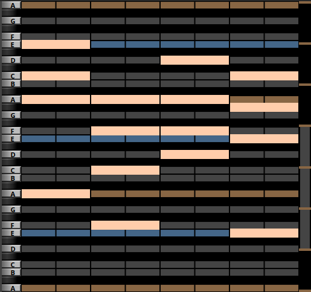

2. Remarquez que les notes basses de chaque accord sont : **La (A)**, **Fa (F)**, **Ré (D)** et **Mi (E)**.

> **Note :** Beepbox utilise la notation anglo-saxonne des notes (C-D-E-F-G-A-B). Voici la correspondance avec la notation française :

| Notation française | Notation anglaise |
|--------------------|-------------------|
| Do                 | C                 |
| Ré                 | D                 |
| Mi                 | E                 |
| Fa                 | F                 |
| Sol                | G                 |
| La                 | A                 |
| Si                 | B                 |

Dans l'exercice 2, nous analyserons comment créer une progression d'accords.

---

### 2. La section rythmique
Cliquez sur l'instrument **gris** dans le menu du bas.

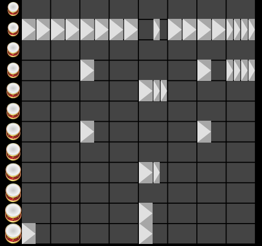

Cet instrument est un peu différent des autres, car il n'utilise pas de notes mais des sons de percussions. Pour l'exercice 1, vous n'avez pas besoin de modifier le rythme. Voici quelques informations supplémentaires :
- Le **deuxième son** en partant du haut est un **hi-hat** qui ajoute de l'intensité au rythme.
- Le **rythme de base** est principalement composé d'un son rond aux cases 1 et 5, et d'un son clair aux cases 3 et 7.

> En musique pop et rock, on utilise souvent une alternance entre le **kick drum** (son rond) et le **snare drum** (son clair).

---

### 3. Mélodie et Basse
Les sections **mélodie (bleu)** et **basse (jaune)** sont les endroits où vous avez le plus de liberté créative dans cet exercice.

- **Basse :** Cliquez sur la section basse (jaune). Vous remarquerez qu'aucune note n'est encore ajoutée. Vous devrez la compléter plus tard.
- **Mélodie :** Cliquez sur la section mélodie (bleue). Remarquez que dans le menu du bas, nous alternons entre le **pattern 2** et le **pattern 3**. Le **pattern 2** est déjà complété, mais vous devrez finaliser le **pattern 3**.

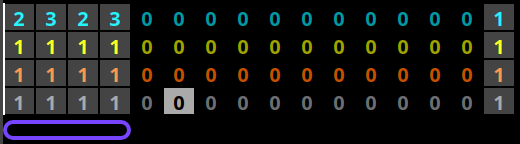

---

Bonne chance avec l'exercice 1 ! Vous pourrez expérimenter et ajuster la mélodie et la basse selon votre créativité.

## Travail à compléter

L'objectif de l'exercice 1 est de :
1. Compléter la mélodie.
2. Composer la ligne de basse.
3. Personnaliser les sons des instruments.

---

### 1. Mélodie

Pour compléter la mélodie de la section 3, commence par écrire une mélodie sur une seule note. Nous voulons que la section 3 "réponde" à la section 2, donc certains rythmes doivent être similaires entre les deux sections.

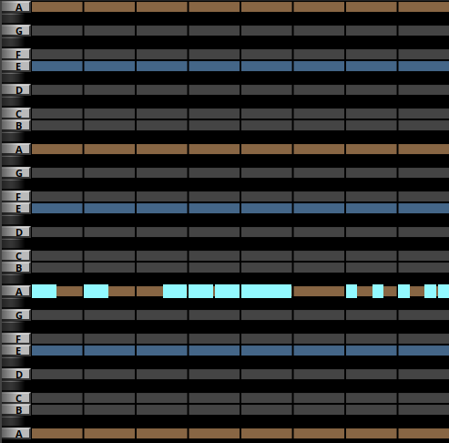

Une fois que tu as trouvé un rythme qui te plaît, tu peux ajuster la hauteur des notes. Il est important d'éviter les fausses notes. Pour t'aider, Beepbox propose un menu de **"Scale"** (gamme). Une gamme est un groupe de notes (généralement 5 à 7) qui sonnent bien ensemble. Pour cet exercice, nous utiliserons la gamme **"easy:("**.

> **Note :** ":(" signifie mineur, car la progression d'accords de cet exercice est en **La mineur**.

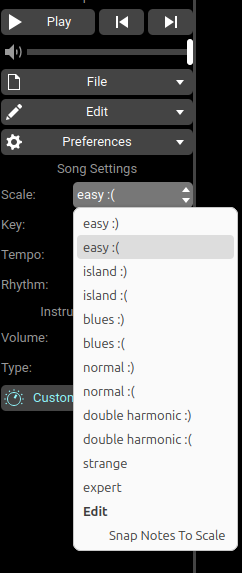

La gamme **easy** est une [gamme pentatonique](https://www.imusic-school.com/blog/fr/encyclopedie/theorie/gamme-pentatonique/) (5 notes). Cela signifie que tu peux utiliser n'importe quelle note de cette gamme sans risquer de jouer une fausse note. Génial, non ?

Tu peux maintenant modifier la hauteur de ta mélodie.

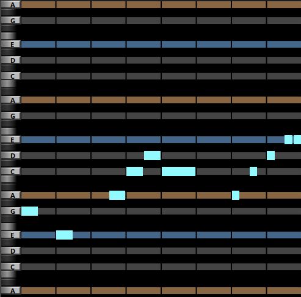

---

### 2. Basse

Pour composer la ligne de basse :
1. Clique sur la section **basse** (jaune).
2. Comme pour la mélodie, commence par composer une ligne rythmique en utilisant une seule note.
3. Une fois satisfait du rythme, ajuste la hauteur des notes tout en conservant la gamme **easy:("**.

> **Conseil :** Nous savons que les accords sont **La mineur**, **Fa majeur**, **Ré mineur**, et **Mi majeur**. Tu peux essayer de jouer ces notes respectivement aux cases **1**, **3**, **5**, et **7**.

---

### 3. Conception sonore

Maintenant que tu as composé ta chanson, tu peux personnaliser les sons des instruments et ajouter des effets pour rendre ta musique unique.

Pour modifier un instrument :
1. Clique sur le menu **Type**.

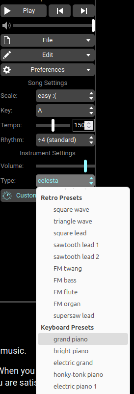

2. Tu peux ensuite cliquer sur **Customize Instrument** pour modifier les effets appliqués à l'instrument (ce ne sera pas couvert dans ce tutoriel).

---

### 4. Exporter ta chanson

Une fois toutes les étapes terminées, exporte ta chanson :
1. Clique sur **File** puis sur **Export**.
2. Assure-toi que les options **Intro** et **Outro** ne sont pas cochées, et que le **loop** est défini à **1**.
3. Sélectionne le format **mp3** et donne un nom à ta chanson.

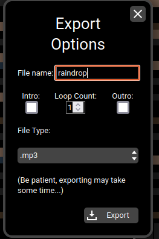

# Exercice 2

Le but de cet exercice est de travailler en équipe de 2 pour créer une musique. Chaque membre de l'équipe compose une chanson avec une harmonie et une ligne de basse, puis échange avec son coéquipier pour que celui-ci complète la mélodie et la section rythmique. Cet exercice vous apprendra principalement à construire une progression de 4 accords en utilisant la théorie musicale.

## Survol

### Basse et mélodie
Le processus pour composer la basse et la mélodie est similaire à celui de l'exercice 1, avec les étapes suivantes :
1. Séparer la chanson en blocs de question-réponse (alternance de motifs).
2. Écrire juste le rythme pour la question.
3. Modifier la hauteur des notes.
4. Refaire les étapes 2 et 3 pour la réponse.
5. Modifier l'instrument et faire la conception sonore.

### Section rythmique
C'est ici que vous pouvez donner une personnalité distincte à votre chanson. Inspirez-vous de rythmes latins, rock, pop, etc. Vous pouvez aussi essayer de récupérer des motifs rythmiques entendus dans la basse ou la mélodie.

### Harmonie
Cette section est la plus complexe. La théorie musicale enseigne comment bâtir un accord (trois notes jouées en même temps) :

1. Écrire les 7 notes de la gamme.  
   ex. Do-Ré-Mi-Fa-Sol-La-Si-Do
2. Choisir une note de base.  
   ex. Fa
3. À partir de cette note, trouver les deux autres en sautant une note à chaque fois (saut de mouton).  
   ex. Fa-La-Do
4. Vous avez maintenant un accord de Fa. Répétez les mêmes étapes pour n'importe quelle autre note de la gamme.

La théorie musicale souligne l'importance de la première et de la cinquième note de la gamme. Essayez de bâtir des accords de Do et de Sol.

**Exemple en La mineur :**  
[La-Si-Do-Ré-Mi-Fa-Sol-La]  
- Premier accord = La-Do-Mi
- Cinquième accord = Mi-Sol-Si

Essayons cela dans Beepbox.

## Tutoriel

### Création du projet
Assurez-vous d'avoir enregistré l'exercice 1, puis cliquez sur "New Blank Song" dans le menu "File".

Trouvez une inspiration pour votre chanson : l'univers d'un film, un jeu vidéo, une activité, etc.

### Création de l'harmonie
Créons une progression d'accords en utilisant la théorie abordée dans la section survol. Sélectionnez la gamme normale dans le menu de droite (scale = C).

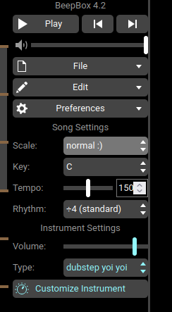

Faites apparaître les notes du piano en sélectionnant "Show Piano Keys" dans le menu préférence.  
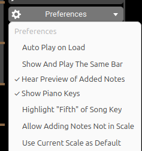

Faites "saut de mouton" pour construire un accord. Voici un accord de Fa (F en notation anglaise).  
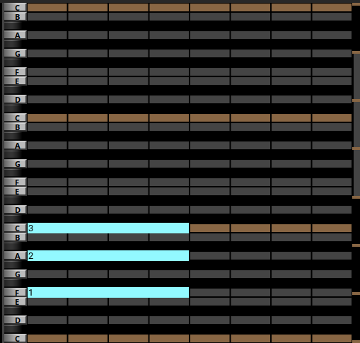

Essayez différentes combinaisons de 4 accords avec des rythmes et des durées variés pour trouver une progression d'accords qui vous plaît. L'accord de Do devrait être particulièrement plaisant.

Vous pouvez également modifier l'ordre des notes dans chaque accord, tant que vous gardez les mêmes trois notes :  
Exemple : Monter la note La (A en notation anglaise) d'une octave (8 notes) pour mieux discerner chaque note de l'harmonie.  
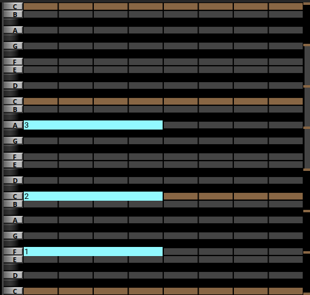

Une fois les accords, leurs rythmes et hauteurs finalisés, changez l'instrument et effectuez la conception sonore.

Vous pouvez maintenant créer une ligne de basse pour accompagner votre harmonie.

### Création de la basse
Suivez les étapes de la section survol pour rédiger la ligne de basse.

- **Conseil 1 :** Essayez d'utiliser les mêmes notes que l'harmonie.
- **Conseil 2 :** La basse soutient tous les autres instruments, alors la simplicité est de mise.

Rappel des étapes :
1. Séparer la chanson en blocs de question-réponse (alternance de motifs).
2. Écrire juste le rythme pour la question.
3. Modifier la hauteur des notes.
4. Refaire les étapes 2 et 3 pour la réponse.
5. Modifier l'instrument et faire la conception sonore.

### Échanger
Une fois que vous avez créé la moitié de la chanson, il est temps d'échanger avec votre partenaire :

1. Donnez un nom à votre chanson et exportez-la au format JSON.  
   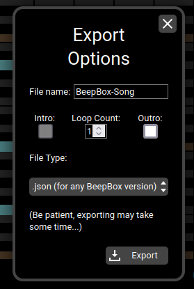
2. Envoyez le fichier .json à votre partenaire.
3. Importez le fichier .json de votre partenaire en cliquant sur "Import Song" dans le menu "File".

Prenez le temps d'analyser la chanson de votre partenaire. Pouvez-vous deviner son inspiration ? Que vous inspire la chanson ?

### Section rythmique
Rappel du survol : c'est ici que vous pouvez donner une personnalité distincte à votre chanson. Inspirez-vous de rythmes latins, rock, pop, etc. Vous pouvez aussi essayer de récupérer des motifs rythmiques entendus dans la basse ou la mélodie.

Une fois que vous avez trouvé un rythme qui vous plaît, vous pouvez changer d'instrument et personnaliser le son.

### Mélodie
Suivez les étapes du survol et de l'exercice 1 pour composer la mélodie.

Rappel des étapes :
1. Séparer la chanson en blocs de question-réponse (alternance de motifs).
2. Écrire juste le rythme pour la question.
3. Modifier la hauteur des notes.
4. Refaire les étapes 2 et 3 pour la réponse.
5. Modifier l'instrument et faire la conception sonore.

**Bonus :** Écrivez une deuxième réponse à la question.  
Question = 1  
Réponse 1 = 2  
Réponse 2 = 3  
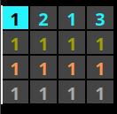

Vous pouvez maintenant exporter en MP3 comme dans l'exercice 1. De plus, il est toujours utile d'enregistrer le projet au format JSON si vous en avez besoin plus tard.

### Présentation PowerPoint
C'est maintenant le moment de créer une présentation pour présenter vos chansons. Elle devrait comporter trois diapositives : Titre, Chanson 1, Chanson 2.

Pour les pages des chansons, chaque coéquipier doit inclure 2 à 3 images de son inspiration, décider d'un titre pour la chanson, puis ajouter la chanson en MP3.
